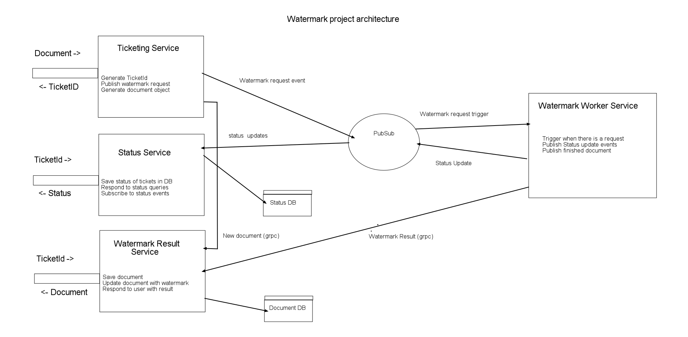

# Watermarking service

A microservices based prject to watermark a document asynchronously.

## Architecture



## Tech stack

1. Kubernetes (GKE)
2. Knative serving and eventing
3. PubSub
4. Nodejs, ExpressJS, Mongodb, GraphQL
5. grpc

## Knative setup

* Create gcloud cluster :- n1-standard-1 VM 1-5 nodes with istio setup

```
export CLUSTER_NAME=knative
export CLUSTER_ZONE=us-west1-c
```

```
gcloud beta container clusters create $CLUSTER_NAME \
  --addons=HorizontalPodAutoscaling,HttpLoadBalancing,Istio \
  --machine-type=n1-standard-1 \
  --cluster-version=latest --zone=$CLUSTER_ZONE \
  --enable-stackdriver-kubernetes --enable-ip-alias \
  --enable-autoscaling --min-nodes=1 --max-nodes=5 \
  --enable-autorepair \
  --scopes cloud-platform
```

* Install Knative serving, Eventing and istio extras

```
kubectl apply --selector knative.dev/crd-install=true \
   --filename https://github.com/knative/serving/releases/download/v0.10.0/serving.yaml \
   --filename https://github.com/knative/eventing/releases/download/v0.10.0/release.yaml

kubectl apply --filename https://github.com/knative/serving/releases/download/v0.10.0/serving.yaml \
   --filename https://github.com/knative/eventing/releases/download/v0.10.0/release.yaml

kubectl apply -f https://raw.githubusercontent.com/knative/serving/master/third_party/istio-1.3.5/istio-knative-extras.yaml
```

* Create service account credentials with permissions to access firestore and pubsub.
* Export credentials in json and convert into base64. Edit google-cloud-key-secret.yaml and replace `<KEY HERE IN BASE64>`

```
kubectl apply -f google-cloud-key-secret.yaml
```

* Config Domain

Get external IP address from the following command

```
kubectl get svc istio-ingressgateway -n istio-system -o jsonpath="{.status.loadBalancer.ingress[0].ip}"
```

Replace the IP in `config-domain.yaml` file and apply the config

```
kubectl apply -f config-domain.yaml
```

* Eventing setup

Enable eventing injection in default namespace

```
kubectl label namespace default knative-eventing-injection=enabled
```

Verify with following command

```
kubectl get Broker default
```

Install PubSub

```
kubectl apply --selector events.cloud.google.com/crd-install=true \
--filename https://github.com/google/knative-gcp/releases/download/v0.10.0/cloud-run-events.yaml

kubectl apply --filename https://github.com/google/knative-gcp/releases/download/v0.10.0/cloud-run-events.yaml
```

Configure Subscriptions

```
kubectl label namespace default knative-eventing-injection=enabled
kubectl apply -f gcp-pubsub-source.yaml
```

Testing events

```
kubectl apply -f event-display.yaml
kubectl apply -f trigger.yaml
kubectl logs --selector serving.knative.dev/service=event-display -c user-container
```

### Setting up Services

* Ticketing service

```
kubectl apply -f ticketing_service/ticketing-knative-service.yaml
```

* Watermark result service

```
kubectl apply -f result_service/result-knative-service.yaml
```